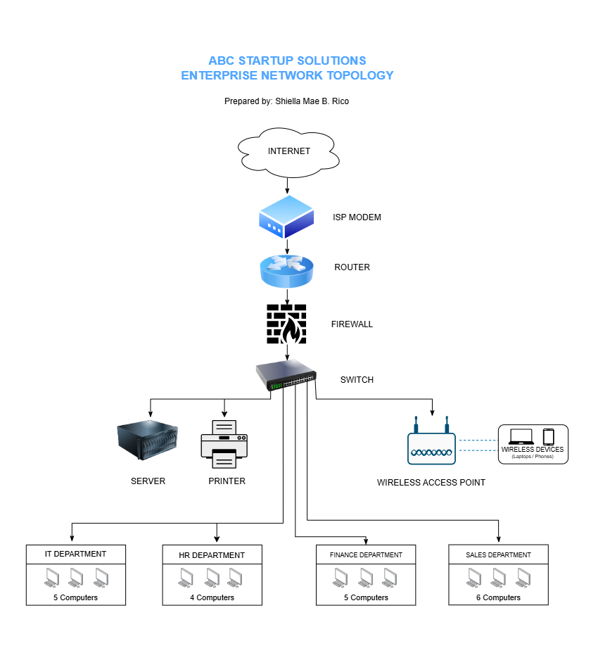

# Enterprise Infrastructure Planning Project

## 📌 Project Overview

This project presents the Enterprise Infrastructure Plan for **ABC Startup Solutions**, a newly established software development company with 20 employees. The project focuses on planning the company's hardware, software, network infrastructure, system administration roles, server requirements, security measures, backup strategy, and future expansion.

The goal of this project is to design a practical and organized IT infrastructure that can support the company's daily operations while considering reliability, security, scalability, and business requirements.

---

## 🎯 Learning Objectives

Through this project, I learned how to:

- Analyze the IT requirements of a small business.
- Identify appropriate hardware, software, and networking requirements.
- Prepare professional IT inventories.
- Design an enterprise network topology.
- Plan server specifications and backup strategies.
- Identify the responsibilities and skills required for different System Administration roles.
- Apply basic security and infrastructure recommendations.
- Create professional technical documentation using Markdown.
- Present infrastructure planning in a professional manner.

---

## 🏢 Company Scenario

### Company Information

- **Company Name:** ABC Startup Solutions
- **Nature of Business:** Software Development
- **Number of Employees:** 20
- **Office Setup:** Single Office Floor
- **Office Location:** [Insert your fictional office location here]

ABC Startup Solutions is a newly established software development company with 20 employees. The company currently has no computers, server, network, internet infrastructure, or security policies, so the entire IT infrastructure must be planned from scratch.

### Employee Distribution

| Department | Employees |
|---|---:|
| Information Technology | 5 |
| Human Resources | 4 |
| Finance | 5 |
| Sales | 6 |
| **Total** | **20** |

The company scenario and employee distribution are based on the project requirements provided in the Week 2 activity. :contentReference[oaicite:1]{index=1}

---

## 🖥️ Hardware Inventory Summary

The hardware inventory was designed according to the needs of the 20 employees and the company's software development operations.

| Hardware | Quantity | Purpose |
|---|---:|---|
| Desktop Computers | 16 | Primary workstations for employees |
| Laptops | 4 | Portable workstations for selected employees |
| Server | 1 | Hosts company services and shared resources |
| Router | 1 | Connects the internal network to the internet |
| Switch | 1 | Connects wired devices within the network |
| Printer | 2 | Provides shared printing services |
| UPS | 2 | Provides power protection |
| Wireless Access Point | 2 | Provides wireless network access |
| NAS Storage | 1 | Provides local backup and storage |
| External Backup Drive | 2 | Provides offline backup storage |
| Monitors | 20 | Provides displays for employee workstations |

The required hardware inventory includes desktop computers, laptops, a server, router, switch, printer, UPS, wireless access point, NAS storage, external backup drives, and monitors. :contentReference[oaicite:2]{index=2}

---

## 💻 Software Inventory Summary

The software inventory includes operating systems, productivity software, development tools, utilities, and security software required by the company.

| Software | Version | Purpose |
|---|---|---|
| Windows 11 Pro | 24H2 | Desktop operating system |
| Ubuntu Server | 24.04 LTS | Server operating system |
| Microsoft 365 | Current | Productivity and office applications |
| Visual Studio Code | Current | Code editing and software development |
| Git | Current | Version control |
| GitHub Desktop | Current | Git and GitHub management |
| VirtualBox | 7.x | Virtual machine management |
| Google Chrome | Current | Web browsing and web applications |
| Microsoft Defender | Built-in | Antivirus and threat protection |
| AnyDesk | Current | Remote technical support |
| 7-Zip | 25.x | File compression and extraction |

The Week 2 instructions specifically require Windows 11 Pro, Ubuntu Server, Microsoft Office, VS Code, Git, GitHub Desktop, VirtualBox, Google Chrome, Microsoft Defender, AnyDesk, and 7-Zip in the software inventory. :contentReference[oaicite:3]{index=3}

---

## 🌐 Embedded Network Diagram

The network topology was designed using **Draw.io** and shows the logical connection between the internet, networking devices, server, printer, and company departments.

> **Note:** Make sure your actual network diagram is saved inside the `diagrams` folder and that the filename matches the image link above.

The network diagram includes the required Internet, ISP Modem, Router, Firewall, Switch, Wireless Access Point, Server, Printer, IT Department, HR Department, Finance Department, and Sales Department. :contentReference[oaicite:4]{index=4}

---

## 👨‍💻 System Administration Roles

The project researched four System Administration roles:

### Helpdesk Technician

Provides technical support to users, troubleshoots hardware and software problems, and assists employees with technical issues.

### Network Administrator

Manages and maintains the company's network infrastructure, including network devices, connectivity, configuration, and troubleshooting.

### Linux System Administrator

Manages Linux-based servers, system services, storage, users, networking, and security.

### Cloud Administrator

Manages cloud-based computing resources, storage, networking, security, identity, and monitoring.

These four professionals work together to maintain the company's IT environment and ensure that users, networks, servers, and cloud services remain functional.

---

## 🛠️ Technologies Used

- **Windows 11 Pro** — Desktop operating system
- **Ubuntu Server 24.04 LTS** — Server operating system
- **Microsoft 365** — Productivity software
- **Visual Studio Code** — Software development
- **Git** — Version control
- **GitHub** — Repository management
- **GitHub Desktop** — Git management
- **VirtualBox** — Virtualization
- **Google Chrome** — Web browsing
- **Microsoft Defender** — Security
- **AnyDesk** — Remote support
- **Draw.io** — Network diagram design
- **Markdown** — Technical documentation

---

## ⚠️ Challenges Encountered

One of the most challenging parts of the project was organizing all the information needed and making sure that each recommendation matched the company's needs. I had to carefully consider the appropriate hardware, software, network setup, security measures, and backup strategies to create a practical IT infrastructure.

Another challenging task was designing the network topology and determining how the different devices should be connected. This required understanding the purpose of each networking device and making sure that the connections were logical and appropriate for the company's requirements.

---

## 📝 Reflection

Through this project, I learned that System Administration involves more than simply setting up computers and installing software. I learned how to analyze the needs of a company and use those requirements to plan its hardware, software, network infrastructure, security, server, backup strategy, and other IT resources.

I also learned the importance of planning before deployment because proper planning can prevent unnecessary expenses, configuration problems, security risks, and compatibility issues. It also helps ensure that the infrastructure can support the organization's current needs and future growth.

This project helped improve my ability to analyze IT requirements, make technical decisions, document infrastructure, and think about security, reliability, and scalability. It gave me a better understanding of how a System Administrator contributes to an organization's IT operations.

---

## 📚 References

### System Administration Roles

- [U.S. Bureau of Labor Statistics — Computer Support Specialists](https://www.bls.gov/ooh/computer-and-information-technology/computer-support-specialists.htm)
- [Cisco — Network Administrator](https://www.cisco.com/site/us/en/learn/training-certifications/tech-roles/network-administrator.html)
- [Red Hat — Red Hat Certified System Administrator](https://www.redhat.com/en/services/certification/rhcsa)
- [Microsoft Learn — Azure Administrator](https://learn.microsoft.com/en-us/credentials/certifications/azure-administrator/)

### Infrastructure and Security

- [CISA — Small and Medium-Sized Business Resources](https://www.cisa.gov/small-and-medium-sized-business-resources)
- [NIST — Digital Identity Guidelines](https://pages.nist.gov/800-63-4/sp800-63b.html)
- [Microsoft — Windows Security](https://www.microsoft.com/en-us/windows/comprehensive-security)
- [Dell Technologies — PowerEdge Servers](https://www.dell.com/en-us/shop/servers-storage-and-networking/sf/poweredge-servers)

